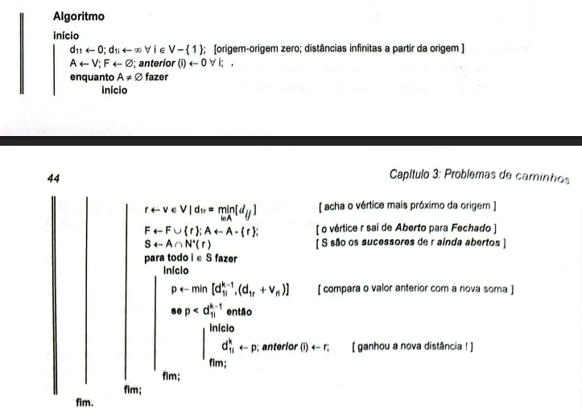
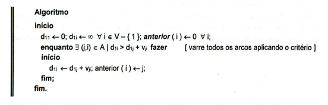
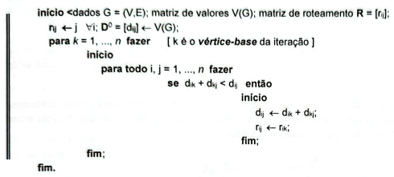

# Comparativo entre Pseudocódigos e Implementações

## 1. Algoritmo de Dijkstra

### Pseudocódigo

```
DIJKSTRA(G, w, s)
1  INITIALIZE-SINGLE-SOURCE(G, s)
2  S ← ∅
3  Q ← V[G]
4  while Q ≠ ∅
5      do u ← EXTRACT-MIN(Q)
6         S ← S ∪ {u}
7         for each vertex v ∈ Adj[u]
8             do RELAX(u, v, w)
```

### Implementação Python
```python
def dijkstra(grafo: Grafo, origem: int) -> Tuple[List[int], List[int]]:
    INF = float('inf')
    
    # INITIALIZE-SINGLE-SOURCE(G, s) - linha 1
    dist = [INF] * grafo.num_vertices
    anterior = [-1] * grafo.num_vertices
    dist[origem] = 0
    
    # Q ← V[G] - linha 3 (usando heap para eficiência)
    heap = [(0, origem)]
    visitados = set()  # S ← ∅ - linha 2
    
    # while Q ≠ ∅ - linha 4
    while heap:
        # u ← EXTRACT-MIN(Q) - linha 5
        dist_atual, u = heapq.heappop(heap)
        
        if u in visitados:
            continue
            
        # S ← S ∪ {u} - linha 6
        visitados.add(u)
        
        # for each vertex v ∈ Adj[u] - linha 7
        for v, peso in grafo.adj_list[u]:
            # RELAX(u, v, w) - linha 8
            if dist[u] + peso < dist[v]:
                dist[v] = dist[u] + peso
                anterior[v] = u
                heapq.heappush(heap, (dist[v], v))
    
    return dist, anterior
```

### Principais Diferenças e Semelhanças

**Semelhanças:**
- A inicialização das distâncias e o conjunto S são implementados conforme especificado
- O laço principal extrai o vértice de menor distância e relaxa suas arestas adjacentes

**Diferenças de Implementação:**
- Estrutura de dados para Q: O pseudocódigo não especifica a implementação de Q. Minha implementação usa um heap binário (`heapq`) para otimizar a operação EXTRACT-MIN de O(V) para O(log V)
- Conjunto S: Implementado como um `set` Python para verificação O(1) de pertencimento
- Função RELAX (facilita a implementação no python): Integrada diretamente no laço ao invés de ser uma função separada
- Vetor de predecessores: Adicionado para permitir reconstrução do caminho

## 2. Algoritmo de Bellman-Ford

### Pseudocódigo

```
BELLMAN-FORD(G, w, s)
1  INITIALIZE-SINGLE-SOURCE(G, s)
2  for i ← 1 to |V[G]| - 1
3      do for each edge (u, v) ∈ E[G]
4             do RELAX(u, v, w)
5  for each edge (u, v) ∈ E[G]
6      do if d[v] > d[u] + w(u, v)
7             then return FALSE
8  return TRUE
```

### Implementação Python
```python
def bellman_ford(grafo: Grafo, origem: int) -> Tuple[List[int], List[int], bool]:
    INF = float('inf')
    
    # INITIALIZE-SINGLE-SOURCE(G, s) - linha 1
    dist = [INF] * grafo.num_vertices
    anterior = [-1] * grafo.num_vertices
    dist[origem] = 0
    
    # for i ← 1 to |V[G]| - 1 - linha 2
    for i in range(grafo.num_vertices - 1):
        # for each edge (u, v) ∈ E[G] - linha 3
        for u, v, peso in grafo.arestas:
            # RELAX(u, v, w) - linha 4
            if dist[u] != INF and dist[u] + peso < dist[v]:
                dist[v] = dist[u] + peso
                anterior[v] = u
    
    # Verificação de ciclo negativo - linhas 5-7
    for u, v, peso in grafo.arestas:
        if dist[u] != INF and dist[u] + peso < dist[v]:
            return dist, anterior, False  # return FALSE
    
    return dist, anterior, True  # return TRUE - linha 8
```

### Principais Diferenças e Semelhanças

**Semelhanças:**
- A ordem de operações é mantida
- A lógica de detecção de ciclo negativo é implementada

**Diferenças de Implementação:**
- Verificação de INF: adicionada verificação `dist[u] != INF` para evitar operações com infinito
- Valor de retorno: Retorna também as distâncias e predecessores, não apenas booleano
- Função RELAX: Novamente integrada ao invés de separada
- Lista de arestas: Utiliza uma representação explícita das arestas para facilitar a iteração

## 3. Algoritmo de Floyd-Warshall

### Pseudocódigo

```
FLOYD-WARSHALL(W)
1  n ← rows[W]
2  D⁽⁰⁾ ← W
3  for k ← 1 to n
4      do for i ← 1 to n
5             do for j ← 1 to n
6                    do d_ij⁽ᵏ⁾ ← min(d_ij⁽ᵏ⁻¹⁾, d_ik⁽ᵏ⁻¹⁾ + d_kj⁽ᵏ⁻¹⁾)
7  return D⁽ⁿ⁾
```

### Implementação Python
```python
def floyd_warshall(grafo: Grafo) -> List[List[int]]:
    INF = float('inf')
    n = grafo.num_vertices
    
    # Inicializar matriz de distâncias - linhas 1-2
    # D⁽⁰⁾ ← W
    dist = [[INF for _ in range(n)] for _ in range(n)]
    
    # Distância de um vértice para ele mesmo é 0
    for i in range(n):
        dist[i][i] = 0
    
    # Preencher com as arestas do grafo
    for u, v, peso in grafo.arestas:
        dist[u][v] = peso
        if not grafo.direcionado:
            dist[v][u] = peso
    
    # for k ← 1 to n - linha 3
    for k in range(n):
        # for i ← 1 to n - linha 4
        for i in range(n):
            # for j ← 1 to n - linha 5
            for j in range(n):
                # d_ij⁽ᵏ⁾ ← min(d_ij⁽ᵏ⁻¹⁾, d_ik⁽ᵏ⁻¹⁾ + d_kj⁽ᵏ⁻¹⁾) - linha 6
                if dist[i][k] + dist[k][j] < dist[i][j]:
                    dist[i][j] = dist[i][k] + dist[k][j]
    
    # return D⁽ⁿ⁾ - linha 7
    return dist
```

### Principais Diferenças e Semelhanças

**Semelhanças:**
- A operação de relaxamento implementa a fórmula min(d_ij, d_ik + d_kj)
- A matriz é inicializada com infinito e depois preenchida com os pesos das arestas

**Diferenças de Implementação:**
- Inicialização da matriz, pseudocódigo assume que W já contém a matriz de adjacência. Nossa implementação constrói esta matriz a partir da representação de lista de arestas
- Python usa indexação base 0, enquanto o pseudocódigo usa base 1 
- Usa notação matricial D^(k), que significa: matriz de distâncias considerando apenas vértices {1,…,k} como intermediários.

## Considerações Finais 

Todas as implementações mantêm a essência e a correção dos algoritmos originais:
- **Dijkstra**: Mantém a propriedade de relaxamento guloso e ordem de processamento
- **Bellman-Ford**: Preserva as V-1 iterações e a detecção de ciclos negativos
- **Floyd-Warshall**: Respeita rigorosamente a ordem dos laços e a fórmula de relaxamento